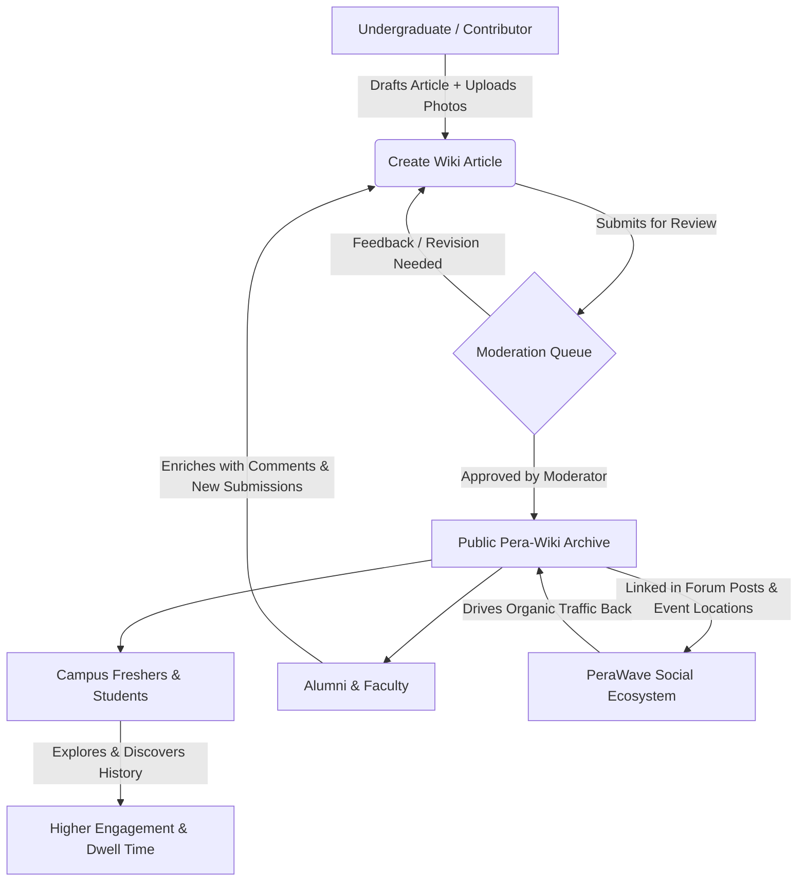

# Pera-Wiki 🏛️📖
### *The Living Heritage & Knowledge Archive of the University of Peradeniya*
*An integral pillar of the **PeraWave** Campus Social & Community Ecosystem*

---

## 📌 Overview & Descriptive Summary

**Pera-Wiki** is a dedicated, crowdsourced digital encyclopedia and heritage knowledge base embedded within the PeraWave platform, specifically crafted to document, preserve, and celebrate the storied history, architectural marvels, cultural traditions, and academic legacy of the University of Peradeniya. Conceived as a "living chronicle" of Sri Lanka’s most picturesque and historic residential university, Pera-Wiki provides students, alumni, academic staff, and campus visitors with an authoritative yet community-curated archive. From Sir Ivor Jennings’ visionary founding and the master architecture of Shirley de Alwis and Sir Patrick Abercrombie, to the cultural folklore surrounding iconic landmarks like the *Sarachchandra Open-Air Theatre (Wala)*, *Akbar Bridge*, *Lover’s Lane*, and the majestic *Hanthana mountain range*, Pera-Wiki serves as both an educational repository and a timeless cultural bridge connecting past, present, and future generations of Peradeniya undergraduates.

---

## 🚀 How Pera-Wiki Drives User Engagement on PeraWave

A common challenge for university community platforms is avoiding the **"feed fatigue"** and transactional usage patterns where users only log in briefly to check lecture notices or event schedules. Pera-Wiki addresses this directly by transforming PeraWave from an ephemeral messaging feed into a **high-retention, high-affinity destination**.

Here is how Pera-Wiki substantially improves user engagement across key behavioral metrics:

### 1. ⏳ Exponential Increase in Session Duration & "Stickiness"
* **Deep-Dive Reading Experience**: Social feeds promote rapid, mindless scrolling with low dwell time. In contrast, well-written wiki articles featuring historical narratives, archival photography, and campus folklore invite students to linger, read, and explore related entries.
* **Serendipitous Discovery**: Built-in contextual cross-links (e.g., clicking on a mention of *Hilda Obeysekera Hall* within an article about the *1950s Residential System*) encourage spontaneous exploration, multiplying pages viewed per active session.

### 2. 🌉 Uniting Generations: Alumni & Freshers Retention
* **The "Fresher Onboarding" Magnet**: Incoming undergraduates enter Peradeniya fascinated by its rich traditions, hall cultures, and historic landmarks. Pera-Wiki becomes their first point of orientation and discovery, creating an immediate, positive relationship with PeraWave from week one.
* **Alumni Nostalgia & Content Contributions**: Alumni possess invaluable photographs, documents, and memories of Peradeniya's golden eras. Pera-Wiki offers a dignified, permanent space for seniors and alumni to contribute, fostering multi-generational interaction that normal student feeds fail to sustain.

### 3. ✍️ Community Co-Creation & Contributor Pride
* **Active vs. Passive Participation**: Social platforms typically suffer from a 90-9-1 rule (90% lurkers, 9% commenters, 1% creators). Pera-Wiki unlocks a new tier of meaningful contribution: student researchers, photographers, and batch historians who might not post casual status updates are empowered to publish long-form, authored wiki entries with moderator-reviewed attribution.
* **Author Recognition**: Featuring contributor names, faculties, and batch badges fosters healthy institutional pride and motivates students to document their faculty's history, student societies, and notable milestones.

### 4. 🔄 Cross-Pollination with Forums & Campus Events
* **Contextual Anchor for Discussions**: When students debate campus affairs or plan cultural festivals in PeraWave Forums, wiki articles act as reference anchors. A forum thread discussing the annual drama festival can link directly to the Pera-Wiki article on *Ediriweera Sarachchandra* and the *Open-Air Theatre*.
* **Event Synergy**: Event locations (e.g., *Gymnasium*, *WUS Building*, *Senate Lawn*) can link directly to their wiki histories, enriching student appreciation of campus venues.

### 5. 🏛️ Cultivating Institutional Identity and Emotional Belonging
* **Pride in Peradeniya Heritage**: Peradeniya is celebrated for its natural splendor and profound academic heritage. By digitally immortalizing this legacy, PeraWave becomes more than just an app; it becomes a digital home and badge of identity for every student and graduate.

---

## 🛠️ Feature Highlights & Capabilities

| Feature | Description |
| :--- | :--- |
| **Comprehensive History & Heritage** | Structured articles detailing university origins, faculties, residential halls, flora, and historical landmarks. |
| **Rich Multimedia Galleries** | Support for archival imagery, campus photography, and historical documents hosted via Cloudinary. |
| **Campus Location Tagging** | Geotagged landmarks helping students connect digital lore with physical campus geography. |
| **Community Submission & Peer Review** | Moderated submission workflow (`PENDING` ➔ `APPROVED` / `REJECTED`) ensuring high factual accuracy and respectful content. |
| **Dynamic Search & Discovery** | Instant title and location filtering to quickly find articles on any landmark or historical topic. |
| **Cross-Platform Responsive UI** | Clean, modern typography and visual aesthetics tailored for seamless desktop and mobile reading. |

---

## 🔄 Content Lifecycle & User Engagement Flow

---

## 💻 Tech Stack & Integration

Pera-Wiki is built directly into the existing full-stack architecture of **PeraWave**:

* **Frontend**: React (Vite) + TypeScript + Tailwind CSS / Vanilla CSS modules
* **Backend**: Node.js + Express.js + TypeScript
* **Database & ORM**: PostgreSQL with Prisma ORM (`WikiArticle` model with author relations)
* **Media Storage**: Cloudinary integration for multi-image historical galleries
* **Security & Moderation**: JWT-authenticated contribution flow with dedicated Moderator role dashboards

---

## 📈 Key Engagement Metrics to Measure

1. **Average Session Duration (Dwell Time)** on wiki pages vs. standard feed pages.
2. **Wiki-to-Forum Referral Rate**: Percentage of users navigating between historical articles and community discussions.
3. **Monthly Active Contributors (MAC)**: Growth of verified students and alumni submitting and editing articles.
4. **Search Queries & Page Views**: Volume of historical campus queries resolved natively on PeraWave.

---

*Preserving Peradeniya's yesterday, inspiring its today, and connecting its tomorrow — Powered by **PeraWave**.*
